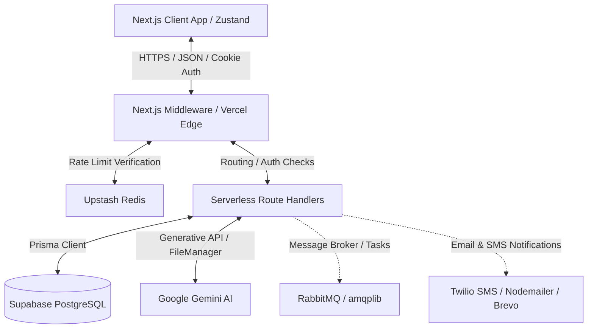
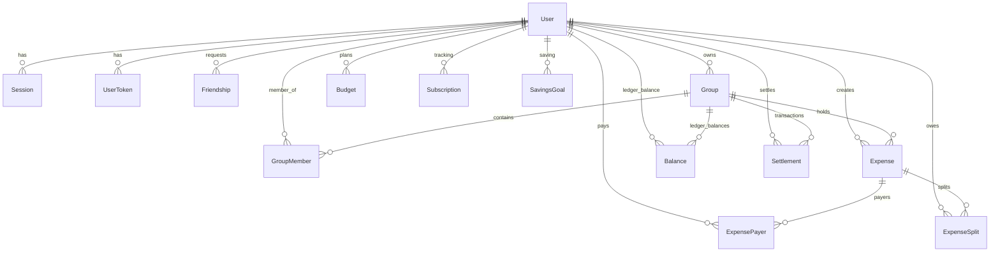

# pAIse (apesp) — Next-Generation AI-Powered Expense Sharing Platform
> **Technical Architecture & Feature Documentation**  
> Greenfield AI-native financial utility platform enabling automated group expense tracking, context-aware chatbot accounting, and edge-based cost governance.

---

## 📋 Table of Contents
1. [Platform Overview](#1-platform-overview)
2. [Tech Stack & System Architecture](#2-tech-stack--system-architecture)
3. [Database Schema & Data Model](#3-database-schema--data-model)
4. [AI Engineering & Integrations](#4-ai-engineering--integrations)
   - [Voice-Powered Expense Entry](#voice-powered-expense-entry)
   - [Smart Receipt Scanning (OCR)](#smart-receipt-scanning-ocr)
   - [Semantic Financial Chatbot (TOON RAG)](#semantic-financial-chatbot-toon-rag)
5. [Performance & Ledger Engineering](#5-performance--ledger-engineering)
   - [Bilateral Net Balance Ledger Caching](#bilateral-net-balance-ledger-caching)
   - [Split Strategies Engine](#split-strategies-engine)
6. [Security, Rate Limiting & DevOps](#6-security-rate-limiting--devops)
   - [Token Rotation & Session Management](#token-rotation-session-management)
   - [Edge Rate-Limiting Architecture](#edge-rate-limiting-architecture)
   - [Background Task Queue (RabbitMQ)](#background-task-queue-rabbitmq)

---

## 1. Platform Overview

**pAIse** is a modern, serverless expense manager that replaces manual ledger entries with AI-driven operations. Designed for roommates, travel groups, and friend circles, the application automates transaction data entry, calculates complex debt settlements, and hosts a private financial accountant chatbot.

### Core Value Propositions
*   **Zero-Input Data Entry**: Handled through voice parsing and receipt OCR.
*   **Bilateral Debt Simplification**: Reduces group payment paths to a minimal set of transactions.
*   **Context-Aware Insights**: A private RAG chatbot that answers relational queries (e.g., *"How much does Rahul owe me for the Goa trip?"*).
*   **Strict Cost Governance**: Built-in edge-level token-bucket rate limiters protecting AI endpoints from abuse.

---

## 2. Tech Stack & System Architecture



### Infrastructure Components
*   **Frontend & Web Framework**: Next.js 16/15 (App Router) + React 19, utilizing Server Components for performance and Zustand for client state management.
*   **Database Engine**: Supabase (PostgreSQL), queried via **Prisma ORM** for type safety and migrations.
*   **Rate-Limiting & Caching Store**: Upstash Redis, enabling distributed sliding-window limiters directly at Vercel's Edge.
*   **AI Engine**: Google Generative AI (using `gemini-2.5-flash` for chatting and `gemini-2.5-flash-lite` for voice/structured processing) and Google AI FileManager for handling large media streams.
*   **Job Processing**: RabbitMQ (`amqplib`) for decoupling heavy tasks like notifications and statement generation.
*   **Comms Providers**: Twilio SMS for OTPs and transaction alerts; Brevo/Nodemailer for rich email communications.

---

## 3. Database Schema & Data Model

The schema (`prisma/schema.prisma`) is built around transactional reliability, denormalized performance caches, and security tables.

### Database Entities & Relationships



#### Major Subsystems in the Database:
1.  **Identity & Session Security**:
    *   `User`: Holds account settings, localization preferences (currency/timezone), and sharing credentials.
    *   `Session`: Tracks multi-device authorization logs (device, OS, IP address).
    *   `UserToken`: Hashed refresh tokens mapped to sessions to implement Token Rotation.
    *   `UserOtp`: Manages expiring dynamic passcodes (`register`, `login`, `forgot_password`).
2.  **Social Graph**:
    *   `Friendship`: Self-referential model tracking `PENDING`, `ACCEPTED`, or `BLOCKED` states between requesters and addressees.
3.  **Expense sharing engine**:
    *   `Group` & `GroupMember`: Represents spaces with role-based memberships (`ADMIN` vs. `MEMBER`).
    *   `Expense`: Relational record storing metadata (description, total amount, category, status).
    *   `ExpensePayer`: Explicit join table tracking who paid and how much (supporting multiple payers).
    *   `ExpenseSplit`: Tracks individual liabilities (Zod validated amounts, percent, or shares).
4.  **Ledger Balances**:
    *   `Balance`: Denormalized bilateral debt record showing the aggregated net balance between User A and User B.
    *   `Settlement`: Stores transactional repayments (UPI, cash) to clear cached `Balance` records.
5.  **Analytics & Personal Finance**:
    *   `ExpenseSummary` / `ExpenseTrend`: Pre-calculated monthly aggregates by category used to render statistics instantly without scanning millions of transaction rows.
    *   `Budget`, `Subscription`, `SavingsGoal`: Personal budget limits, recurring payment calendars, and financial targets.

---

## 4. AI Engineering & Integrations

pAIse utilizes the Gemini API for natural voice recognition, receipt OCR parsing, and context-aware chatbot accounting.

### Voice-Powered Expense Entry
The voice-expense engine processes user recordings to create pre-populated drafts:
1.  **Audio Ingestion**: Client uploads raw audio (e.g. `wav`, `m4a`, `webm`). Next.js validates file size ($\le 10\text{MB}$) and type.
2.  **Google FileManager Upload**: Next.js writes the audio buffer to disk, uploads it to Google AI FileManager, and retrieves a temporary URI.
3.  **Context Injection**: The platform pulls active group/friend participants, today's date, and current user ID. This is sent to the LLM to prevent identity confusion.
4.  **Structured Prompt Execution**:
    *   Using **Gemini 2.5 Flash Lite**, a structured JSON output schema is enforced.
    *   The model transcribes and parses the script:
        *   Maps spoken names to valid user IDs within the context list.
        *   Resolves split commands (e.g. *"Split equally"*, *"I paid full"*, *"Rahul owes 200"*).
        *   Classifies into categories (`Food & Dining`, `Housing & Utilities`, `Travel`, etc.).
5.  **Clean up**: The audio file is deleted from Google Cloud storage immediately, and the parsed JSON is hydrated with database names/avatars to return a draft to the client.

### Smart Receipt Scanning (OCR)
Converts invoices and receipts into structured transactions:
*   Uploaded receipt image is analyzed using Gemini's vision capability.
*   Enforces a schema parsing: Merchant Name $\rightarrow$ Description, Grand Total $\rightarrow$ Amount, Individual line items $\rightarrow$ Splits.
*   Uses OCR to extract transactional date, tax amounts, and payment method options automatically.

### Semantic Financial Chatbot (TOON RAG)
Instead of piping large raw JSON arrays of user expenses into the LLM (which increases latency, token costs, and context size), pAIse uses **Token-Optimized Object Notation (TOON)**:

#### The TOON Protocol:
A custom format designed to compress financial snapshot data into a highly token-efficient string.
*   Removes redundant keys (e.g., `"name": "Alice"` $\rightarrow$ `"Alice"`).
*   Uses positional variables (e.g., `Alice:500` indicates `Name:Amount`).
*   Uses compact delimiters (`|` or newlines for sections, `,` for items).

*Example of TOON compression:*
```text
STATS:Debtors=1,Creditors=2
I_OWE:Rahul:250.00
OWED_TO_ME:Bob:120.00,Alice:50.00
RECENT:Goa Trip Dinner(1200)@2026-06-25; Cafe Chai(90)@2026-06-27
```

#### Chat Workflow:
1.  **Query Sanitization**: Script cleans input keywords to prevent prompt injection.
2.  **Context Retrieval**: Gets the user's current rolling memory session (`AiChatSession.summary`).
3.  **Financial Hydration**: Queries active balances and the last 5 expenses, converting them to TOON.
4.  **Gemini 2.5 Flash execution**: The prompt runs, outputting:
    *   `answer`: Contextual financial reply (concise, friendly, using ₹).
    *   `new_summary`: A 1-sentence interaction update to maintain rolling conversational memory.
5.  **State Save**: Saves both answer and query to `AiChatMessage` and updates the conversational summary memory in a database transaction.

---

## 5. Performance & Ledger Engineering

### Bilateral Net Balance Ledger Caching
Recalculating net debt balances by scanning the entire transactional history of a group on every page load causes significant database load. pAIse implements **Bilateral Balance Caching**:

```text
At transaction:
User X pays ₹1000, User Y owes ₹500 (Split: EQUAL)

1. Determine alphabetical order: User_A_ID < User_B_ID.
2. If User_X = A and User_Y = B:
   - Debit balance: Amount increases by +₹500.
3. If User_X = B and User_Y = A:
   - Credit balance: Amount decreases by -₹500.
4. Upsert Balance record matching key: { user_A_id, user_B_id, group_id }.
```

*   **Alpha Order Invariant**: Ensures that for any two users, there is at most **one** database row representing their balance, preventing duplicate inverse rows (A owes B $\leftrightarrow$ B owes A).
*   **O(1) Balance Lookup**: The dashboard fetches balances via a simple query:
    `WHERE user_A_id = userId OR user_B_id = userId`.
*   **One-Click Settlements**: Settlement payments (UPI, cash) adjust these cached records directly.

### Split Strategies Engine
The ledger handles four mathematical modes of debt division (`SplitType`):
1.  **EQUAL**: Divides the total amount equally among $N$ selected participants.
2.  **EXACT**: Validates that the sum of custom values allocated to users equals the total expense amount.
3.  **PERCENTAGE**: Allocates shares by weight ($\%$) and validates that the sum of percentages equals exactly $100\%$.
4.  **SHARE**: Distributes costs based on weighted ratios (shares).
    $$\text{User Owed Amount} = \text{Total Amount} \times \left( \frac{\text{User Shares}}{\text{Total Shares}} \right)$$

---

## 6. Security, Rate Limiting & DevOps

### Token Rotation & Session Management
pAIse implements a high-security custom JWT authentication system:
*   **Double Token Strategy**:
    *   **Access Token**: Short-lived, stored in secure memory or HTTP-Only cookies.
    *   **Refresh Token**: Long-lived, stored in PostgreSQL (`UserToken`) and validated on rotation.
*   **Automatic Rotation (RTR)**: On token exchange, the old refresh token is deleted, and a new one is issued. If a client attempts to reuse a revoked refresh token, the database session is terminated (protecting against token theft).

### Edge Rate-Limiting Architecture
All API routes are protected by edge-level middleware limits using `@upstash/ratelimit` running sliding-window check bounds on Upstash Redis:

| API Scope | Rate Limit | Reset Time | Purpose |
| :--- | :--- | :--- | :--- |
| **General POST** | 5 requests | 10 seconds | Prevents API spam / DB exhaustion |
| **Authentication** | 5 requests | 60 seconds | Brute-force protection (login/register) |
| **Public AI Chat** | 5 requests | 24 hours | Protects API key from excessive costs |
| **Private AI Chat** | 10 requests | 24 hours | Authenticated user daily budget |
| **Voice AI Expense** | 5 requests | 24 hours | Large file processing control |
| **Receipt OCR Scan** | 5 requests | 24 hours | Vision model billing protection |

### Background Task Queue (RabbitMQ)
Heavy operations are offloaded asynchronously to queue workers:
*   **Event Publishing**: Whenever expenses are added/updated or settlements recorded, Next.js publishes messages to RabbitMQ exchanges.
*   **Notification Delivery**: A background consumer processes events to create database notifications, queue emails via Brevo SMTP, and trigger SMS warnings via Twilio.
*   **Balance Recalculation**: Heavy calculations are decoupled from the HTTP response loop, keeping API response times minimal.
